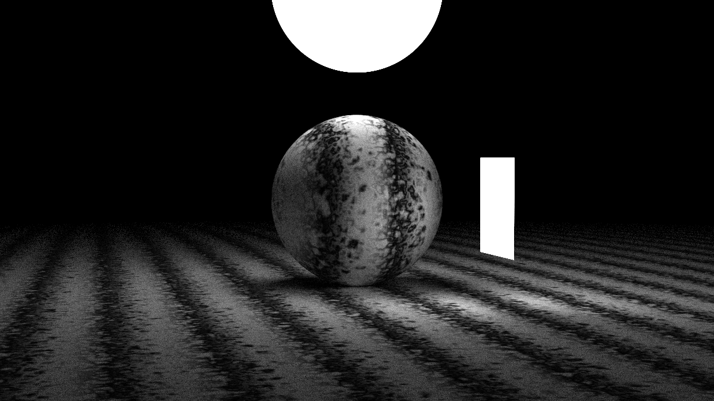

# ray tracing the next week
Rust implementation for the [RayTracingTheNextWeek](https://raytracing.github.io/books/RayTracingTheNextWeek.html) with additional multithreading to speed up the program.

# final scene

 

# Some other sample scenes

- random_balls

 

- two spheres

 

- earth

 

- two perline spheres

 

- quad

 

- simple light

 

- cornell box

 

- cornell smoke

 

